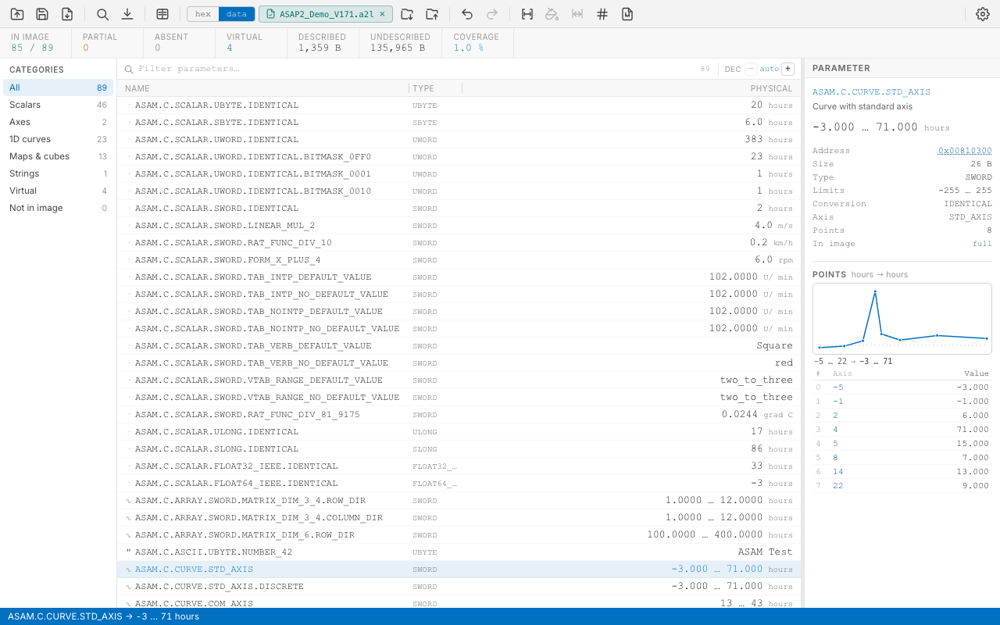
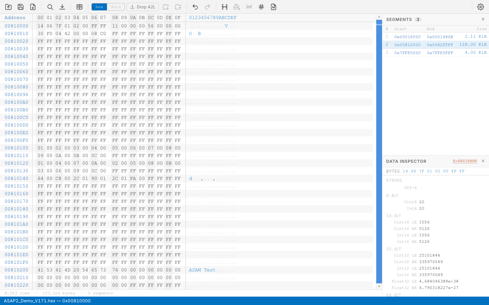
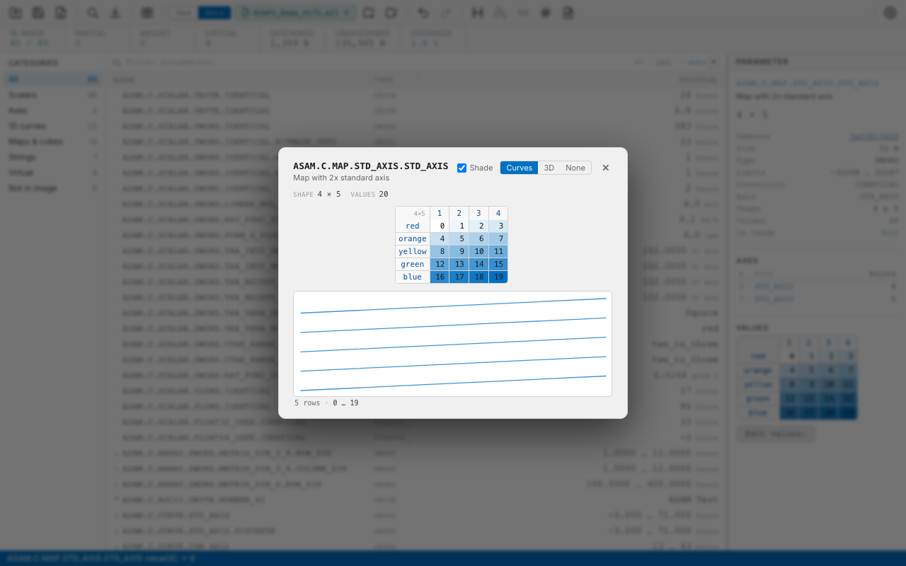

# Hex Studio

A fast, cross-platform hex editor for **Intel HEX**, **Motorola S-record**, and **raw binary** files, built with Tauri 2, SvelteKit, and Rust.

Load an **ASAM MCD-2 MC (A2L)** description alongside the image and it also becomes a calibration editor: named parameters with their physical values, curves and maps you can edit in place, and **ASAM CDF 2.1 (CDFX)** import and export.

---



<table>
<tr>
<td width="50%"><a href="docs/screenshots/hex.png"></a></td>
<td width="50%"><a href="docs/screenshots/map.png"></a></td>
</tr>
<tr>
<td align="center"><em>Hex view — with the segment list and data inspector</em></td>
<td align="center"><em>Map editor — shaded grid, verbal axis, curves per row</em></td>
</tr>
</table>

<sup>Screenshots show real values decoded from the ASAM ASAP2 demo image; regenerate with <a href="docs/screenshots/capture.sh"><code>docs/screenshots/capture.sh</code></a>.</sup>

---

## Features

### File Handling
- **Open** Intel HEX (`.hex`, `.ihex`), Motorola S-record (`.srec`, `.mot`, `.s19`, `.s28`, `.s37`), and raw binary (`.bin`) files via native OS file picker
- **Drag and drop** a file directly onto the window to open it
- **Save As** to Intel HEX or S-record with automatic format conversion; export to flat binary with configurable fill byte
- **Import Binary** — load a raw `.bin` file at a user-specified base address
- Format auto-detection from file extension and magic bytes
- **OS file-association open** — double-clicking an associated file in the OS file manager launches the app and loads the file directly

### Hex Viewer
- **Virtual scrolling** — renders only visible rows, handles files of any size without performance degradation
- Configurable **bytes per row**: 8, 16, or 32
- Address column, hex byte columns (with mid-row gap at byte 8), and ASCII representation
- Alternating column shading and row hover highlighting; clickable bytes pin the Data Inspector
- Non-printable bytes rendered as `.`
- **Segment boundary visualisation** — non-contiguous memory regions are separated by a gap row showing the gap size and address range; leading blank cells show where a segment starts mid-row

### In-Place Editing
- **Type over any byte** — double-click a byte in either the hex or the ASCII column and type two hex digits. The cell highlights while the first nibble is pending, and the caret advances to the next byte once the pair completes. **Tab** confirms and advances, **Enter** confirms and stays, **Escape** cancels. Only bytes that exist can be edited; gaps between segments are not writable this way
- **Undo / Redo** (⌘Z / ⌘⇧Z) — every operation below is one entry on a 50-step history; the window title carries a **●** while there are unsaved changes
- **Cut / Paste / Delete** on a byte selection, through an internal binary clipboard kept separate from the system clipboard so it can hold raw bytes rather than text. Paste writes at the selection start, or at the top visible address when nothing is selected; the right-click menu additionally offers **paste into empty space only**
- **Select Range…** (⌘⇧A) — select an exact address span by typing its start and end, for ranges too large to drag

#### Edit Operations
- **Fill Selection…** — repeat a hex pattern (`FF`, or `DE AD BE EF`) across the selection, or check **Randomize** to fill with random bytes. Warns when the pattern does not divide evenly into the range
- **Move Selection…** — relocate the selected bytes to a new base address
- **Import from File…** — merge an IHex, S-record or binary file into the current one, with a preview of the segments it would add
- **Insert Checksum…** — compute **XOR**, **sum-8**, **CRC-16** or **CRC-32** over a range and write the result back into the image at a chosen address, with selectable width (1/2/4 bytes) and byte order (LE/BE). Start, end and target addresses are pre-filled from the file's own layout

Fill, Move, Paste and Import each offer two write modes: **overwrite existing**, or **fill empty only** — the latter writes solely into address gaps, leaving existing data untouched.

### Physical Data View (A2L)

Load an ASAM MCD-2 MC description (`.a2l`) and the image stops being bytes and becomes named, converted parameters.

- **Load** via *File > Load associated A2L…* (⌘⇧D), the toolbar's drop target, or by dropping an `.a2l` file on the window
- The A2L last used with a given hex file is **remembered and pre-filled**, but never auto-loaded — the association is a hint, and silently decoding against the wrong description is worse than asking
- **hex / data** toggle in the toolbar switches between the byte view and the parameter view; the segment list and data inspector belong to the hex view and are hidden (not forgotten) in the data view
- **Coverage banner**: objects in the image, partial, absent, virtual, described and undescribed bytes, and the percentage of the image the description accounts for
- **Categories** sidebar filters by shape — Scalars, Axes, 1D curves, Maps & cubes, Strings, Virtual, Not in image — each with a live count. *Unsupported* appears only when a file actually contains one
- **Columns**: Name, Address, Type, Raw and Physical, individually resizable; Address, Type and Raw are toggleable in Preferences (only Type is on by default)
- **Decimals stepper** overrides the A2L `FORMAT` for every fractional value at once
- **MEASUREMENT objects** can be shown alongside characteristics (Preferences) — useful when reading a RAM dump rather than a calibration image

### Editing Physical Values

Every edit is encoded in Rust and applied through the same write path as a hex edit, so it joins the same undo history and modified flag.

- **Scalars** — typed directly, with a **slider** spanning the declared limits and stepping by one raw LSB, so it can only land on values the field can actually store
- **Enumerations** — chosen from the labels the `COMPU_METHOD` defines, for scalars, curve points and map breakpoints alike. A verbal value is written by name, since such a conversion has no numeric inverse
- **ASCII strings** — edited as text, limited to what the array holds including its terminator
- **1D curves and axes** — an axis→value point table, with a **plot** above it that follows the draft as you type rather than waiting for the commit
- **Jump to bytes** — any parameter's address opens the hex view at that offset, and a curve referencing a shared axis links to the object that owns it

### Maps, Cuboids and Cubes

`MAP`, `CUBOID`, `CUBE_4` and `CUBE_5` decode and encode in full.

- The detail pane shows a **shaded grid preview**, elided to fit, with the object's shape (`4 × 5`) and one row per axis
- **Edit values…** opens a full-size grid: X breakpoints across the top, Y down the side, cells editable in place, shading on a value ramp
- Anything beyond two dimensions gets a **slice selector** per extra dimension, reducing a cuboid or cube to a plane
- A **family-of-curves plot** draws each row of the visible slice; hovering a row in the grid traces its curve and the reverse. Every curve shares one vertical scale, pinned to the whole object, so slices stay comparable as you step through them

**Which breakpoints can be edited** depends on where the bytes are:

| Axis | Data lives in | Editable |
|------|---------------|----------|
| `STD_AXIS` | this object's own record | yes |
| `COM_AXIS`, `RES_AXIS` | a shared `AXIS_PTS` object | on that object — linked from the grid |
| `CURVE_AXIS` | another characteristic's values | on that object |
| `FIX_AXIS` | the A2L itself (`FIX_AXIS_PAR` / `_DIST` / `_LIST`) | no — it occupies no image bytes |

### Calibration Data Exchange (CDFX)

Import and export ASAM CDF 2.1 files. Both entries stay disabled until an A2L **and** a hex file are loaded, since neither half means anything alone.

- **Import** shows what would change before anything is written: how many parameters would change, already match, were skipped and why, and which names the A2L does not define — then applies the whole set as **one undo entry**
- Differences are compared as **stored bytes** rather than physical values, so a value that rounds to the same raw is correctly reported as no change
- **Export** writes every value the description can decode, with `SW-ARRAYSIZE` for real grids, one `SW-AXIS-CONT` per dimension, shared axes as references, and verbal values as their labels
- Numbers are written at round-trip precision rather than display precision, so re-importing an export does not rewrite the image
- Dropping a `.cdfx` file on the window opens the same preview

### Spreadsheet Export

**File > Export Values as Excel…** writes every decoded value to an `.xlsx`, one
row per value — 673 rows for the ASAM demo description. Export only; nothing
reads a spreadsheet back.

- The **`Index`** column says where each value sits: `Scalar` or `String` for the
  single-valued shapes, otherwise a 0-based tuple in A2L dimension order —
  `(3)` along a curve, `(2,1)` in a map, `(2,1,3,1)` in a `CUBE_4`. The first
  component varies fastest, matching `MATRIX_DIM` and the storage order.
- **`Breakpoints`** carries the axis values at that position in the same shape,
  `(3, 15)`, so a row can be read on its own. A verbal axis reads as its label.
- A one-dimensional object also gets its breakpoint as a **number**, in
  `Axis value`, which is what makes a curve chartable in Excel directly.
- Numbers are written as numbers, not text. That is the reason for a workbook
  rather than CSV: a comma-separated file opens as a single column wherever the
  locale expects `;` as the separator and `,` as the decimal mark.
- Objects that could not be decoded still get a row, with the value columns
  empty and `In image` saying why, so the export and the object count agree.

Columns: `Name`, `Description`, `Category`, `Index`, `Breakpoints`,
`Axis value`, `Value`, `Text`, `Unit`, `Address`, `Type`, `Conversion`,
`Conversion type`, `In image`. The header row is frozen and filtered.

### A2L Constructs Supported

- **Conversions**: `IDENTICAL`, `LINEAR`, `RAT_FUNC`, `TAB_INTP`, `TAB_NOINTP`, `TAB_VERB`, `COMPU_VTAB_RANGE`, and `FORM` with a built-in expression parser (`FORMULA_INV` for the inverse)
- **Record layouts**: field placement by declared position with `MOD_COMMON` / per-layout **alignment padding**, `RESERVED` fields, `NO_AXIS_PTS_*`, `AXIS_PTS_X/Y/Z/4/5`, `AXIS_RESCALE_X`
- **Storage order**: `INDEX_INCR` / `INDEX_DECR` per axis, and `ROW_DIR` / `COLUMN_DIR` for function values
- **`BIT_MASK`** fields, read and written as a read-modify-write so neighbouring fields in the same word survive
- **`VIRTUAL_CHARACTERISTIC`** — evaluated from its formula and its input parameters, and reported as computed rather than as missing data
- **`MATRIX_DIM`**, including the pre-1.7 spelling that pads a flat array out to three dimensions
- Byte order from `MOD_COMMON` or per object; `FORMAT` from the object or its `COMPU_METHOD`

### Copy Selection to Clipboard
- **Right-click context menu** on any selected byte range offers six copy formats:
  - **Hex string (spaced)** — `4D 5A 90 00`
  - **Hex string** — `4D5A9000`
  - **C array** — `{ 0x4D, 0x5A, 0x90, 0x00 }`
  - **Python bytes** — `b'\x4d\x5a\x90\x00'`
  - **Base64** — `TVqQAA==`
  - **ASCII / UTF-8 string** — printable characters; non-printable bytes rendered as `·`
  - **UTF-16 LE / UTF-16 BE string** — shown only when the selection has an even byte count
- Each menu item shows a live truncated preview of the formatted value
- Clipboard writes are plain-text only (no RTF/HTML side-car types) via `arboard` directly on the native pasteboard

### Binary File Comparison (Diff Viewer)
- **File > Compare with…** or toolbar button opens a second file picker; a dedicated comparison window appears with:
  - Side-by-side hex display (16 bytes per row, no ASCII column) of the reference and compared files
  - **Virtual scrolling** — diff views of large files render instantly
  - Byte-level highlighting: identical bytes in normal colour, differing bytes highlighted in red/orange
  - **Gap markers** between identical regions showing the address span (`0x00001000 – 0x00001FFF`) of skipped identical bytes
  - **Expand / collapse** individual identical sections by clicking their gap marker; collapsed gaps remain linked to both files' addresses
  - **Processing spinner** shown during initial computation; uses a double `requestAnimationFrame` pattern so the UI paints before the heavy JS work runs
- **Optimised IPC**: a single `parse_file` Rust command reads and parses IHex/SREC in one call, eliminating the double round-trip; byte lookups use `Uint8Array` typed arrays (~5× faster than `Map`)

### HTML Export — Diff Report
- **Export as HTML…** link in the diff legend bar opens an options dialog:
  - **Show paths**: toggle display of full file paths vs. filenames only
  - **Sections**: export all collapsed, all expanded, or as currently shown on screen
- Generates a fully self-contained HTML file with embedded CSS, dark/light themes (`prefers-color-scheme`), and no external dependencies
- **Difference statistics** section: compared bytes, identical bytes, different bytes
- File paths aligned in columns (reference right-aligned, compared left-aligned)
- Footer watermark: *Difference report generated by Hex Studio*
- Default filename: `diff-<ref>-<cmp>.html`

### HTML Export — Hex Report
- **File > Export as HTML…** or the toolbar download icon opens an options dialog:
  - **Show ASCII column** (default on)
  - **Show full file path** in the report header (default off)
  - **Columns**: 8, 16, or 32 bytes per row — independent of the current viewer setting
- Generates a self-contained HTML file with the same visual style as the viewer (dark/light themes)
- **Statistics** section: total bytes, address range (`0x…` prefix), segment count
- Footer watermark: *Hex export generated by Hex Studio*
- Default filename: `<stem-of-file>.html`

### Search & Navigation
- **Find** panel (⌘F / Ctrl+F) — floating, draggable, non-blocking
  - **Text search** with case-sensitive option
  - **Hex pattern search** (e.g. `DE AD BE EF`)
  - Forward / Backward direction with Wrap Around
  - **Find** / **Find Next** for sequential navigation
  - **Find All** — lists every match address; click any entry to navigate
- **Go to Address** (⌘G / Ctrl+G) — jump to any hex address in the loaded file

### Side Panels (View menu or ⌘⇧L / ⌘⇧I)
- **Segment List** — lists all non-contiguous memory segments with start address, end address, and size; click a row to scroll the viewer to that segment
- **Data Inspector** — displays the bytes at the current address decoded as u8, i8, u16/u32/u64 (LE & BE), f32/f64 (LE & BE); address follows the scroll position or is pinned by clicking a byte
- Both panels are independently togglable; their visibility is persisted across sessions

### Preferences (⌘,)
- **Theme**: System / Dark / Light (CSS custom-property based, applied globally)
- **Font size**: 10 – 20 px slider
- **Bytes per row**: 8, 16, or 32
- **Data view columns**: show or hide Address, Type and Raw — the detail pane always shows all of it, so nothing is ever made unreachable
- **Show measurements**: include MEASUREMENT objects in the data view alongside characteristics

### OS File Associations
- **Build-time** associations for Intel HEX and S-record extensions (registered via OS installer / `Info.plist`)
- **Runtime dialog** (View → File Associations…) — shows the current association status for each extension including `.bin`, with checkboxes and an Apply button
  - Windows: `HKCU\Software\Classes` registry + `SHChangeNotify`
  - macOS: Launch Services `LSSetDefaultRoleHandlerForContentType` (association only; deassociation not supported by the OS API)
  - Linux: `xdg-mime default`

### User Interface
- Native **macOS menu bar** — File (Open, Save as, Export as HTML, Import Binary, Load A2L, Import/Export Calibration Data, Compare with…), Edit (Undo, Redo, Cut, Paste, Delete, Select Range, Fill, Move, Import from File, Insert Checksum), Search, View, Preferences
  - The system-injected **Writing Tools** and **AutoFill** items are removed from the Edit menu, which are meaningless for a hex editor
- **Toolbar** with icon buttons: Open · Save · Export HTML · [divider] · Find · Go to Address · [divider] · Compare · [divider] · Undo · Redo · Select Range · Fill · Move · Checksum · Import Merge · [auto-spacer] · Settings
  - Edit icons are **context-aware**: those needing a selection stay disabled until one exists, and Undo/Redo follow the history
- **Status bar** — loading progress, navigation results; errors shown as native OS dialogs
- **Window size and position** persisted across sessions via `tauri-plugin-window-state`; default launch size 925 × 460
- OS window title updated with the currently open filename

### Cross-Platform
- macOS `.app` + `.dmg` (Apple Silicon)
- Windows `.msi` + `.exe` (via GitHub Actions Windows runner)
- Linux `.deb` / `.AppImage` (via GitHub Actions Ubuntu runner)
- Full icon set: `.icns` (macOS), `.ico` (Windows, 7 sizes), `.png` (Linux)

---

## Development Toolchain

| Component | Technology | Version |
|-----------|-----------|---------|
| App framework | [Tauri 2](https://tauri.app) | 2.x |
| Frontend | [SvelteKit](https://kit.svelte.dev) + [Svelte 5](https://svelte.dev) | 5.x |
| Build tool | [Vite](https://vitejs.dev) | 6.x |
| Backend / commands | [Rust](https://rust-lang.org) | stable (1.94+) |
| IHex parsing | [`ihex`](https://crates.io/crates/ihex) crate | 3.0 |
| A2L parsing | [`a2lfile`](https://crates.io/crates/a2lfile) crate | 3.5 |
| CDFX (XML) | [`quick-xml`](https://crates.io/crates/quick-xml) crate | 0.41 |
| Excel export | [`rust_xlsxwriter`](https://crates.io/crates/rust_xlsxwriter) crate | 0.96 |
| File I/O | [`memmap2`](https://crates.io/crates/memmap2) crate | 0.9 |
| Serialisation | [`serde`](https://crates.io/crates/serde) + `serde_json` | 1.0 |
| Native clipboard | [`arboard`](https://crates.io/crates/arboard) crate | 3.x |
| Native dialogs | `@tauri-apps/plugin-dialog` | 2.x |
| Window state | `tauri-plugin-window-state` | 2.x |
| Package manager | npm | 11.x |

---

## Getting Started

### Prerequisites

| Tool | macOS | Windows | Linux |
|------|-------|---------|-------|
| Rust toolchain | `curl --proto '=https' --tlsv1.2 -sSf https://sh.rustup.rs \| sh` | [rustup.rs](https://rustup.rs) | same |
| Node.js LTS | [nvm](https://github.com/nvm-sh/nvm) or [nodejs.org](https://nodejs.org) | [nvm-windows](https://github.com/coreybutler/nvm-windows) | nvm |
| Xcode CLT | `xcode-select --install` | — | — |
| WebView2 | — | pre-installed on Win 10/11 | — |
| `webkit2gtk` | — | — | `sudo apt install libwebkit2gtk-4.1-dev` |

### Run in development mode

```bash
git clone https://github.com/brice-fr/hex-studio.git
cd hex-studio
npm install
npm run tauri dev
```

Hot-reload is active for both the Svelte frontend and Rust backend.

### Build a release

**macOS DMG:**
```bash
npm run tauri build
# → src-tauri/target/release/bundle/dmg/Hex Studio_0.3.1_aarch64.dmg
```

**Windows MSI** (requires Windows or GitHub Actions):
```bash
npm run tauri build
# → src-tauri/target/release/bundle/msi/Hex Studio_0.3.1_x64_en-US.msi
```

### Automated releases via GitHub Actions

Push a version tag to trigger a multi-platform build:

```bash
git tag v0.3.1
git push origin v0.3.1
```

The workflow (`.github/workflows/release.yml`) builds macOS and Windows bundles and publishes them as GitHub Release assets automatically.

---

## Project Structure

```
hex-studio/
├── src/                          # SvelteKit frontend
│   ├── lib/
│   │   ├── api.js                # Tauri invoke abstraction layer
│   │   ├── editOps.js            # Record-level edit primitives + checksums
│   │   ├── mapGrid.js            # Grid index arithmetic, slicing, shading
│   │   ├── plot.js               # Screen geometry for the parameter plots
│   │   ├── hexHtmlExport.js      # Hex viewer HTML report generator
│   │   └── components/
│   │       ├── HexViewer.svelte        # Virtual-scrolling hex display + copy menu
│   │       ├── FileMenu.svelte         # Toolbar icon buttons
│   │       ├── HexExportDialog.svelte  # Hex HTML export options dialog
│   │       ├── DiffViewer.svelte       # Side-by-side binary diff + HTML export
│   │       ├── CompareDialog.svelte    # File picker for diff comparison
│   │       ├── FindDialog.svelte       # Floating search panel
│   │       ├── GoToDialog.svelte       # Go-to-address modal
│   │       ├── SaveFormatDialog.svelte # Format picker modal
│   │       ├── AboutDialog.svelte      # About modal
│   │       ├── SegmentList.svelte      # Segment list side panel
│   │       ├── DataInspector.svelte    # Data inspector side panel
│   │       ├── PreferencesDialog.svelte# Preferences modal
│   │       ├── FileAssocDialog.svelte  # File associations modal
│   │       ├── SelectRangeDialog.svelte# Select an address range by typing it
│   │       ├── FillDialog.svelte       # Fill selection with pattern or random
│   │       ├── MoveDialog.svelte       # Relocate selection to a new address
│   │       ├── ChecksumDialog.svelte   # Checksum algorithm, width, endianness
│   │       ├── ImportMergeDialog.svelte# Merge another file into this one
│   │       ├── DataView.svelte         # A2L parameter table + coverage stats
│   │       ├── ParamDetail.svelte      # Parameter editor, point table, plot
│   │       ├── MapGrid.svelte          # One 2D slice, preview or editable
│   │       ├── MapEditor.svelte        # Full-size map grid overlay
│   │       ├── MapPlot.svelte          # A map as a family of curves
│   │       └── CdfxImportDialog.svelte # CDFX import preview and statistics
│   └── routes/
│       ├── +page.svelte          # App shell and native menu
│       └── compare/
│           └── +page.svelte      # Diff viewer window
├── src-tauri/
│   ├── src/
│   │   ├── main.rs               # Entry point
│   │   ├── lib.rs                # Tauri builder + plugin registration
│   │   ├── commands.rs           # Tauri command handlers
│   │   ├── file_operations.rs    # File I/O, IHex & SREC writers
│   │   ├── hex_parser.rs         # Intel HEX parser
│   │   ├── srec_parser.rs        # Motorola S-record parser
│   │   ├── a2l.rs                # Tauri bridge to the a2l-data crate
│   │   └── file_assoc.rs         # OS file association management
│   ├── crates/a2l-data/          # A2L decoding and encoding (own crate)
│   │   ├── src/db.rs             # Parsed A2L, object resolution, index maths
│   │   ├── src/layout.rs         # RECORD_LAYOUT to byte offsets
│   │   ├── src/convert.rs        # COMPU_METHOD, both directions
│   │   ├── src/formula.rs        # FORM / VIRTUAL expression parser
│   │   ├── src/decode.rs         # Bytes to physical values
│   │   ├── src/encode.rs         # Physical values back to bytes
│   │   ├── src/cdfx.rs           # ASAM CDF 2.1 read and write
│   │   ├── src/sync.rs           # CDFX import planning and export
│   │   ├── src/export.rs         # One row per value, for the spreadsheet
│   │   └── tests/demo_file.rs    # End-to-end against the ASAM demo pair
│   ├── icons/                    # Full icon set (icns, ico, png)
│   ├── capabilities/             # Tauri ACL permissions
│   └── tauri.conf.json           # App configuration
├── static/                       # Web-accessible static assets
├── .github/workflows/            # CI/CD release pipeline
├── LICENSE                       # MIT
└── README.md
```

---

## License

This project is released under the **MIT License** — see [LICENSE](LICENSE) for full text.

```
SPDX-License-Identifier: MIT
Copyright (c) 2026 Brice LECOLE
```
